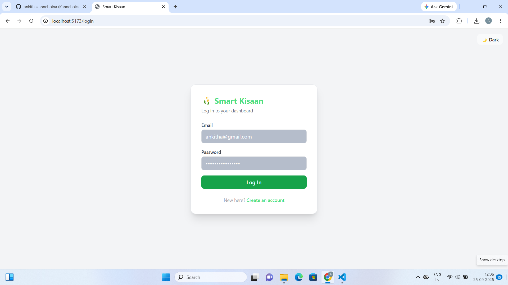
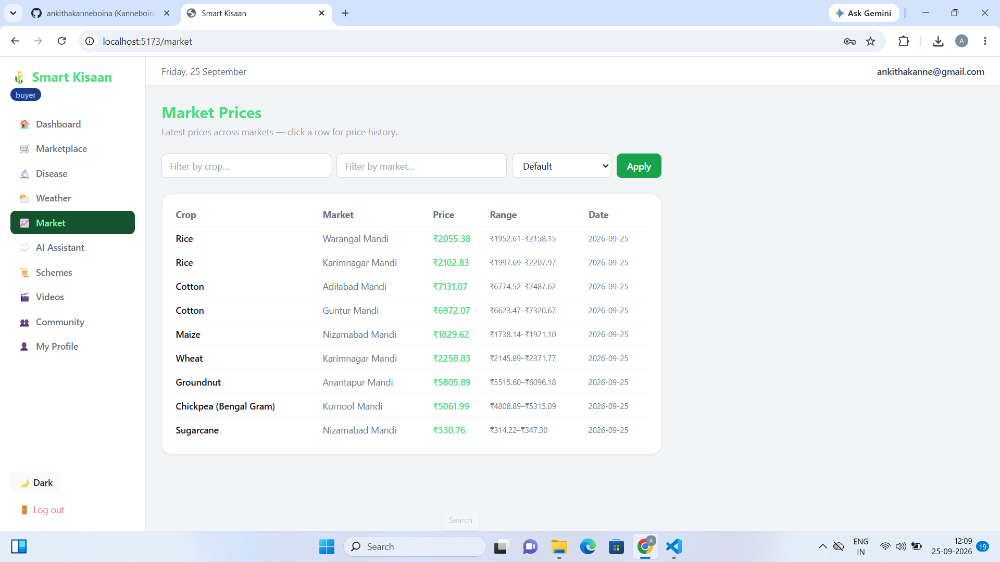
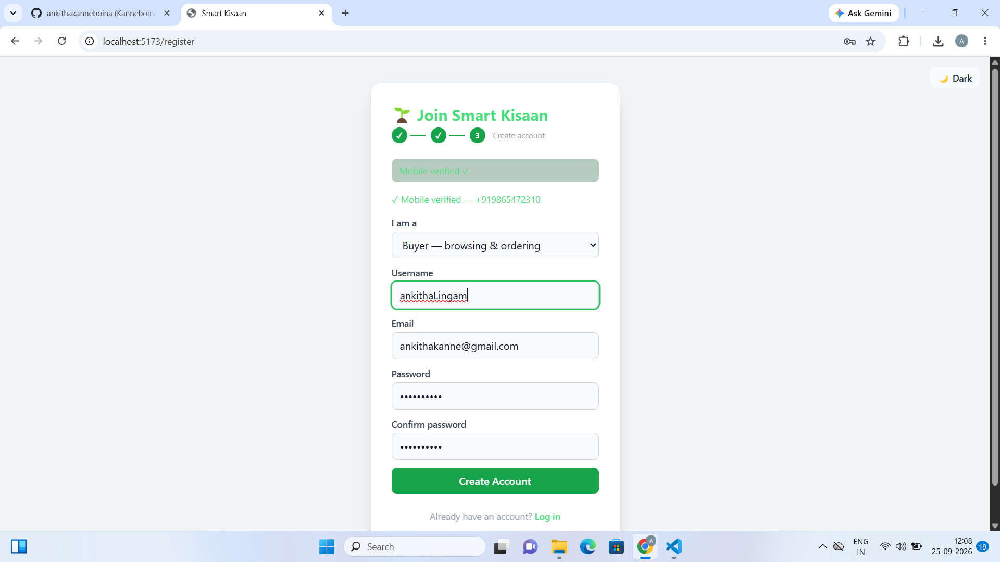
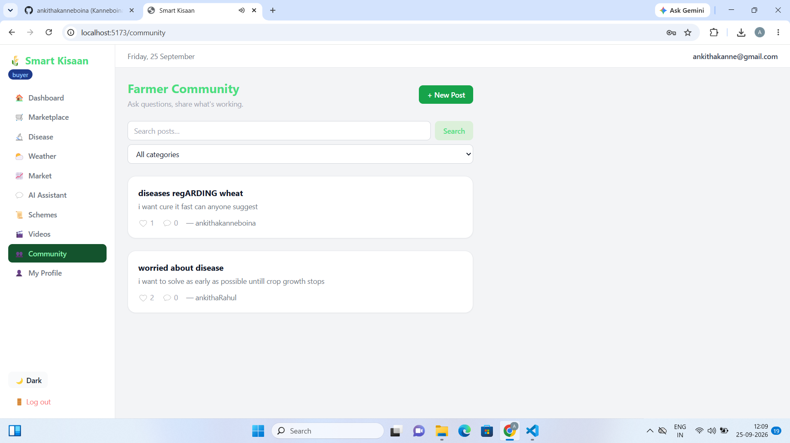
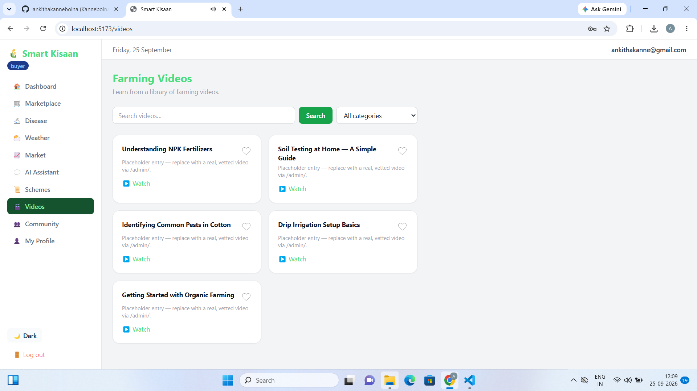
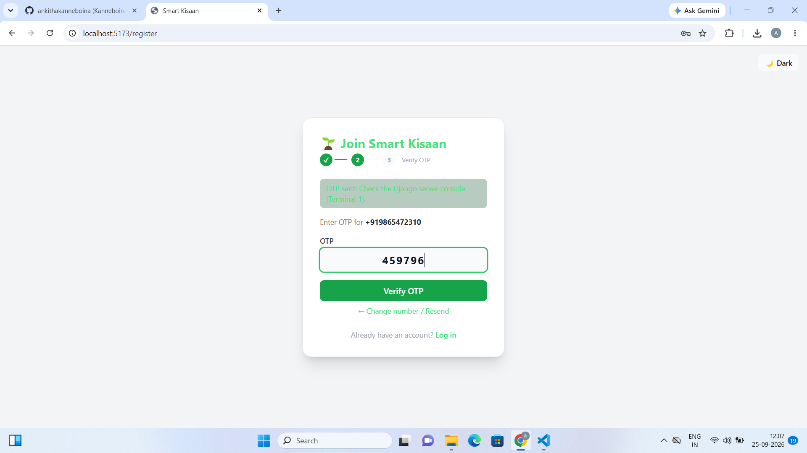
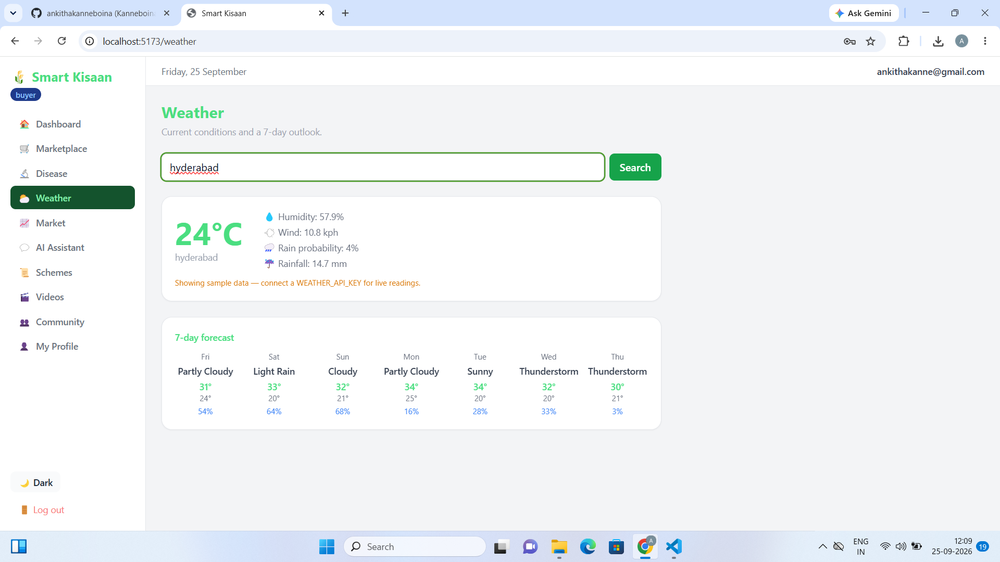
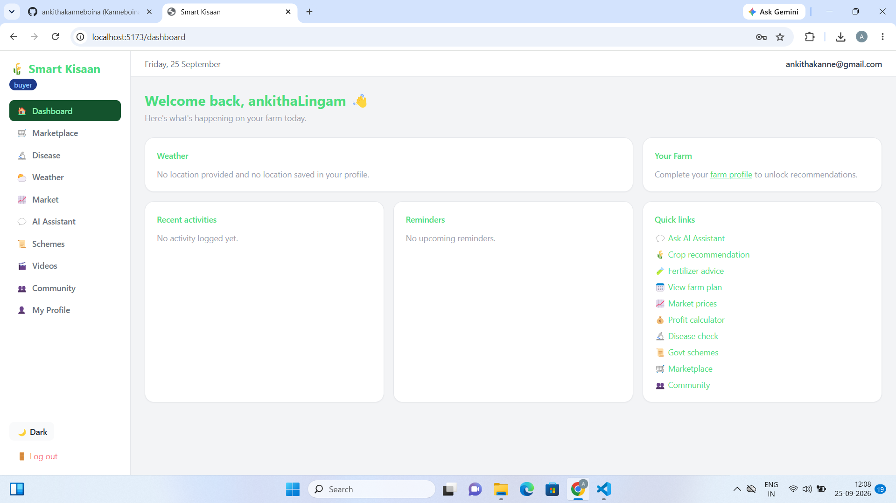
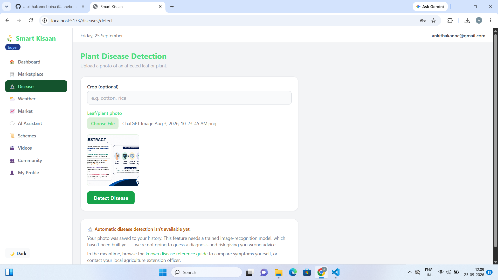

# 🌾 Smart Kisaan

## AI-Powered Smart Farming Assistance Platform

**Smart Kisaan** is an AI-powered smart farming assistance platform designed to provide farmers with useful agricultural information and assistance through a simple and user-friendly web application.

The platform brings together farming assistance, market information, weather information, community interaction, educational videos, account management, and AI/ML-based features in one application.

---

## ✨ Key Features

- 🌱 **Farming Assistance**
- 📊 **Market Data**
- 🌦️ **Weather Information**
- 👤 **Account Management**
- 👥 **Farmer Community**
- 🎥 **Agricultural Videos**
- ✅ **Verified Information**
- 🤖 **AI-Based Assistance**
- 🦠 **Disease Detection**
- 🌾 **Crop Recommendations**
- 📊 **User Dashboard**
- 🔐 **User Authentication**

---

# 🛠️ Technologies Used

### Frontend
- React.js
- JavaScript
- HTML
- CSS

### Backend
- Python
- Django
- Django REST Framework

### Database
- SQLite

### AI / Machine Learning
- Python
- Machine Learning
- AI-based agricultural assistance

### Tools
- Git
- GitHub
- REST APIs
- VS Code

---

# 📂 Project Structure

```text
SmartKisaan/
│
├── backend/
│
├── frontend/
│
├── ml_models/
│
├── ScreenshotsP/
│   ├── home.png
│   ├── market-data.png
│   ├── account.png
│   ├── community.png
│   ├── videos.png
│   ├── verified.png
│   ├── weather.png
│   ├── dashboard.png
│   ├── crop-recommendation.png
│   └── disease-detection.png
│
├── README.md
│
└── .gitignore
```

---

# 📸 Application Screenshots

## 🏠 Home

The Smart Kisaan home interface provides access to the major farming-related services available in the platform.



---

## 📊 Market Data

The Market Data section provides users with access to agricultural market-related information.



---

## 👤 Account

The Account section allows users to manage and access their account-related information.



---

## 👥 Community

The Community section provides a space for users to interact and access community-oriented agricultural information.



---

## 🎥 Videos

The Videos section provides agricultural and farming-related video content.



---

## ✅ Verified Information

The Verified section presents verified agricultural information available within the application.



---

## 🌦️ Weather

The Weather section provides weather-related information useful for farming activities.



---

## 📊 Dashboard

The dashboard provides access to the main Smart Kisaan services and features.



---

## 🌱 Market Places

The crop recommendation functionality provides farming-related recommendations based on the available application functionality.


---

## 🦠 Disease Detection

The disease detection functionality supports identification of plant-related disease conditions using the implemented AI/ML functionality.



---

# 🎥 Project Demo

## ▶️ Smart Kisaan Demo Video

The complete project demonstration shows the major features and workflow of the Smart Kisaan platform.

### 🎬 Watch the Demo

**[▶️ Click Here to Watch Smart Kisaan Demo](https://youtu.be/o52ZcGyOv2E)**

> The demo video is hosted externally instead of being stored directly in the repository because GitHub limits individual repository files to 100 MB.

---

# 🚀 Main Modules

### 🌱 Farming Assistance

Provides users with farming-related assistance through the application.

### 📊 Market Data

Provides agricultural market-related information.

### 🌦️ Weather

Provides weather-related information for farming use.

### 👥 Community

Provides community-oriented interaction and information sharing.

### 🎥 Videos

Provides farming-related educational video content.

### ✅ Verified

Provides verified agricultural information.

### 👤 Account

Provides user account-related functionality.

### 🤖 AI / ML

Provides AI/ML-powered functionality implemented within the project.

---

# ⚙️ Installation & Setup

## 1. Clone the Repository

```bash
git clone https://github.com/ankithakanneboina/Smartkisaan-2.git
```

```bash
cd Smartkisaan-2
```

---

# 🔧 Backend Setup

Open a terminal:

```powershell
cd backend
```

Create a virtual environment:

```powershell
python -m venv venv
```

Activate it:

```powershell
venv\Scripts\activate
```

Install dependencies:

```powershell
pip install -r requirements.txt
```

Run migrations:

```powershell
python manage.py migrate
```

Start the backend:

```powershell
python manage.py runserver
```

Backend:

```text
http://127.0.0.1:8000/
```

---

# 💻 Frontend Setup

Open another terminal:

```powershell
cd frontend
```

Install dependencies:

```powershell
npm install
```

Start the frontend:

```powershell
npm run dev
```

Frontend:

```text
http://localhost:5173/
```

---

# 🔄 Application Flow

```text
                 🌾 SMART KISAAN
                       │
                       ▼
                ┌───────────────┐
                │    Frontend   │
                │   React.js    │
                └───────┬───────┘
                        │
          ┌─────────────┼─────────────┐
          ▼             ▼             ▼
      🌱 Farming     📊 Market     🌦️ Weather
      Assistance       Data
          │             │             │
          └─────────────┼─────────────┘
                        ▼
                ┌───────────────┐
                │    Backend    │
                │ Django + DRF  │
                └───────┬───────┘
                        │
              ┌─────────┴─────────┐
              ▼                   ▼
        🗄️ Database           🤖 AI / ML
```

---

# 🎯 Project Objective

The objective of Smart Kisaan is to develop a technology-assisted farming platform that brings useful agricultural services and information together in a single user-friendly application.

The project explores the practical use of:

- Artificial Intelligence
- Machine Learning
- Full-Stack Development
- REST APIs
- Database Management
- User Authentication
- Web Technologies

---

# 📚 Learning Outcomes

Through this project, the following technical areas were explored:

- Full-stack web application development
- React.js frontend development
- Django backend development
- REST API development
- Database integration
- AI/ML integration
- Authentication
- Git and GitHub
- User interface development
- Project documentation

---

# 🔮 Future Scope

Possible future improvements include:

- Larger agricultural datasets
- Improved AI/ML models
- More crop and disease categories
- More regional-language support
- Enhanced recommendations
- Cloud deployment
- Mobile application
- Additional agricultural services

---

# 👩‍💻 Developer

## Ankitha Kanneboina

**B.Tech Computer Science and Engineering**

### Areas of Interest

- Artificial Intelligence & Machine Learning
- Full-Stack Development
- Software Engineering
- Data Structures & Algorithms

### 🔗 Connect

**GitHub:**  
https://github.com/ankithakanneboina

**LinkedIn:**  
https://www.linkedin.com/in/ankitha-kanneboina-45a545324/

---

# ⭐ Project

If you find the project useful, consider giving the repository a ⭐.

---

## 📌 Note

Smart Kisaan was developed as an academic and portfolio project to explore the practical application of AI/ML and full-stack technologies in the agriculture domain.
